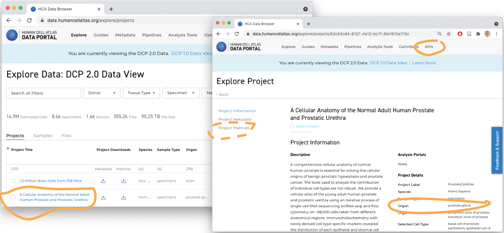

```{r, include = FALSE}
knitr::opts_chunk$set(
  collapse = TRUE,
  comment = "#>",
  cache = identical(Sys.info()[["nodename"]], "GVLY610WKT")
)
```

## Overview

### Description

FIXME: Along with the topic of your workshop, include how students can expect
to spend their time. For the description may also include information
about what type of workshop it is (e.g. instructor-led live demo, lab,
lecture + lab, etc.). Instructors are strongly recommended to provide
completely worked examples for lab sessions, and a set of stand-alone
notes that can be read and understood outside of the workshop.

### _R_ / _Bioconductor_ packages used

The focus is on the [hca][] package. This package emphasize [dplyr][]
and 'tidy' approaches to working with data.frames. Files downloaded
from the HCA or CellXGene web sites can be imported into R /
Bioconductor as [SingleCellExperiment][] objects through the
[LoomExperiment][] and [zellkonverter][] packages.

[hca]: https://bioconductor.org/packages/hca
[cellxgenedp]: https://bioconductor.org/packages/cellxgenedp
[dplyr]: https://cran.r-project.org/package=dplyr
[SingleCellExperiment]: https://bioconductor.org/packages/SingleCellExperiment
[LoomExperiment]: https://bioconductor.org/packages/LoomExperiment
[zellkonverter]: https://bioconductor.org/packages/zellkonverter

### Time outline

| Activity                            | Time |
|-------------------------------------|------|
| Introduction to the HCA data portal |  5m  |
| HCA discovery in R / Bioconductor   | 10m  |

### Workshop goals and objectives

List "big picture" student-centered workshop goals and learning
objectives. Learning goals and objectives are related, but not the
same thing. These goals and objectives will help some people to decide
whether to attend the conference for training purposes, so please make
these as precise and accurate as possible.

*Learning goals* are high-level descriptions of what
participants will learn and be able to do after the workshop is
over. *Learning objectives*, on the other hand, describe in very
specific and measurable terms specific skills or knowledge
attained. The [Bloom's Taxonomy](#bloom) may be a useful framework
for defining and describing your goals and objectives, although there
are others.

### Learning goals

Some examples:

* describe how to...
* identify methods for...
* understand the difference between...

### Learning objectives

* analyze xyz data to produce...
* create xyz plots
* evaluate xyz data for artifacts

## Workshop

### Single-cell analysis in _Bioconductor_

Extensive support for single-cell analysis in _Bioconductor_

- E.g., 213 packages tagged 'SingleCell' in the release branch

    

- Quality control, normalization, variance modeling, data integration
  / batch correction, dimensionality reduction, clustering,
  differential expression, cell type classification, etc
- Infrastructure to support large out-of-memory data, etc.
- Typically, processing after a 'count matrix' has been obtained

Orchestrating Single-Cell Analysis with _Bioconductor_ ([OSCA][]) --
an amazing resource!


[OSCA]: https://bioconductor.org/books/OSCA/

### A quick [dplyr][] 'tidy' refresher

Recall

- A `tibble()` is a `data.frame()` but with a nicer display.
- A few common commands allow many standard manipulations
  - `filter()`: filter to include only specific rows
  - `select()`: select columns
  - `mutate()`: change or add columns
  - `glimpes()`: get a quick summary of the first rows of the `tibble`
  - `left_join(x, y, by =)` is a somehat more advanced function,
    merging all rows of tibble `x` with rows in `y` that match for
    columns specified by `by=`.
- _R_ introduced the 'pipe' `|>`, typically used to take the output of
  one command and 'pipe' it to the first input argument of the next
  command

```{r mtcars}
suppressPackageStartupMessages({
    library(dplyr)
})

tbl <- as_tibble(mtcars, rownames = "car")
tbl
tbl |>
    filter(cyl == 6) |>
    select(car, mpg, disp, hp) |>
    mutate(`L/100km` = 235.2 / mpg) # Liters per 100 km
```

### Exploring the Human Cell Atlas Data Portal

Human Cell Atlas [data portal][HCA-data-portal]



[HCA-data-portal]: https://data.humancellatlas.org/explore/projects

### Working with HCA data

Why use an _R_ script when the Data Portal exists?

- Easily reproducible
- Flexible exploration of rich & complex data
- Direct integration with _Bioconductor_ single-cell workflows

Load required packages

```{r}
suppressPackageStartupMessages({
    library(hca)
    library(LoomExperiment)
    library(SummarizedExperiment)
})
```

Discover projects

```{r discover-projects}
## basic information, like HCA data portal
p <- projects()
p

## much more information
pe <- projects(as = "tibble_expanded")
pe
```

Select subsets of projects using filters, e.g., studying
liver. Possible to specify several filters at once.

```{r project-filters}
liver_filter <- filters(
    specimenOrgan = list(is = "liver")
)
liver_projects <- projects(liver_filter)
liver_projects

liver_projects |>
    select(projectId, projectTitle)

## facet options available for filtering: facet_options()
```

Main functions for exploring HCA data

- `projects()`: finding projects of interest.
- `bundles()`, `samples()`: can be useful when exploring a single
  project in detail.
- `files()`: use to download files (e.g., fastq files to start an
  analysis from scratch; '.loom' files containing gene x cell count
  matrices produced by standard HCA pipelines).
- `hca_next()`, `hca_prev()` to 'page' through large datasets.

### Discovering and downloading '.loom' files

HCA standard processing pipelines

Projects with .loom files produced by the standard pipeline satisfy
the following filter

```{r dcp2-files}
standard_loom_file_filter <- filters(
    fileSource = list(is = "DCP/2 Analysis"),
    fileFormat = list(is = "loom"),
    workflow = list(is = "optimus_post_processing_v1.0.0")
)
loom_files <- files(standard_loom_file_filter)
```

Which projects studying the liver have a standard loom file available?

```{r liver-loom-files}
liver_loom_projects <- left_join(
    liver_projects, loom_files,
    by = c("projectId", "projectTitle")
)
liver_loom_projects
```

Choose one project more-or-less arbitrarily, for demonstration purposes

```{r liver-loom-project-1}
liver_loom_projects |>
    filter(projectId == "4d6f6c96-2a83-43d8-8fe1-0f53bffd4674") |>
    glimpse()
```

Create a filter and download the file

```{r liver-loom-download}
liver_loom_filter <- filters(
    projectId = list(is = "4d6f6c96-2a83-43d8-8fe1-0f53bffd4674"),
    fileSource = list(is = "DCP/2 Analysis"),
    fileFormat = list(is = "loom"),
    workflow = list(is = "optimus_post_processing_v1.0.0")
)
loom_file_path <-
    files(liver_loom_filter) |> # find files matching filter
    files_download()            # download (and cache) to local disk
```

The file is cached locally, so running `files_download()` a second
time does not re-download it.

### Integration with _R_ / _Bioconductor_ work flows

'.loom' files are easily integrated into _R_ / _Bioconductor_
workflows using the [LoomExperiment][] package.

```{r LoomExperiment}
suppressPackageStartupMessages({
    library(LoomExperiment)
})
loom <- import(loom_file_path)
loom
```

The `metadata()` of the loom file contains useful information on
provenance.

```{r metadata}
metadata(loom) |> str()
```

The .loom files produced by the standard HCA pipeline contain QC
metrics on the rows (genes) and columns (cells), but no biological
information about the cells. Remedy this using
`optimus_loom_annotation()`

```{r optimus_loom_annotation}
annotated_loom <- optimus_loom_annotation(loom)
annotated_loom

new_columns <- setdiff(
    names(colData(annotated_loom)),
    names(colData(loom))
)
length(new_columns)
```

The following uses names of the annotation columns to show that there
are 5 donors (4 males and one female) ranging in age from 21
to 65 years old. There are between 39782 and 87538 cells per donor.

```{r cell-info}
colData(annotated_loom) |>
    as_tibble() |>
    dplyr::count(
        biomaterial_id = donor_organism.biomaterial_core.biomaterial_id,
        sex = donor_organism.sex,
        organism_age = donor_organism.organism_age
    )
```

A minimal coercion creates a [SingleCellExperiment][] that can be used
in standard _R_ / _Bioconductor_ single cell workflows.

```{r sce}
sce <-
    annotated_loom |>
    as("SingleCellExperiment")
sce
```

## Acknowledgements

```{r}
sessionInfo()
```
