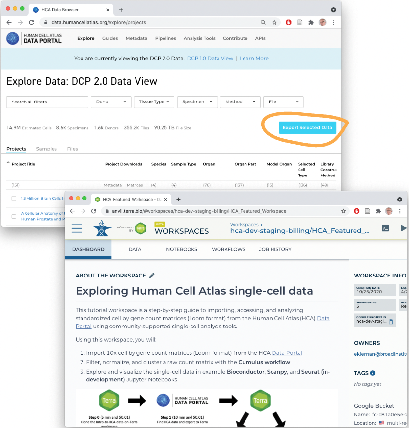
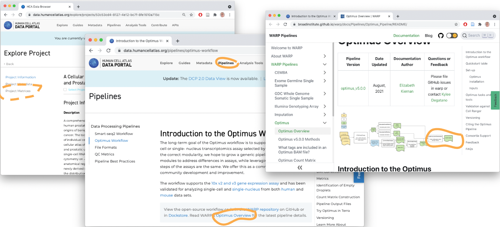

```{r, include = FALSE}
knitr::opts_chunk$set(
  collapse = TRUE,
  comment = "#>",
  cache = identical(Sys.info()[["nodename"]], "GVLY610WKT")
)
```

## Overview

### _R_ / _Bioconductor_ packages used

The focus of this vignette is use of data in the [AnVIL computational
cloud][]. The [AnVIL][] package provides many functions that
facilitate efficient use of this resource.

[hca]: https://bioconductor.org/packages/hca
[cellxgenedp]: https://bioconductor.org/packages/cellxgenedp
[dplyr]: https://cran.r-project.org/package=dplyr
[SingleCellExperiment]: https://bioconductor.org/packages/SingleCellExperiment
[LoomExperiment]: https://bioconductor.org/packages/LoomExperiment
[zellkonverter]: https://bioconductor.org/packages/zellkonverter

[AnVIL computational cloud]: https://anvilproject.org
[AnVIL]: https://bioconductor.org/packages/AnVIL

### Time outline

| Activity                                        | Time |
|-------------------------------------------------|------|
| Introduction to the AnVIL project               |  2m  |
| AnVIL and the HCA                               |  2m  |
| AnVIL and Bioconductor -- the [AnVIL][] package |  3m  |

## Workshop

### Recap: HCA and CellXGene data

[HCA][HCADP] and [CellXGene][CXGDP] data portals

[HCADP]: https://data.humancellatlas.org/explore/projects
[CXGDP]: https://cellxgene.cziscience.com/

HCA to AnVIL



### Workflows for data reduction -- from fastq to loom

Overall workflow

- Researchers design experiments and submit samples to genomics core
  facilities
- Core facilities sequence samples and generate 'fastq' files
- Fastq files are transformed to count matrices summarizing expression
  of genes in individual cells
- (Perhaps) Core facility performs initial analysis of count matrices
- (Probably) Researcher wishes they could do different variations of
  the analysis performed by the core facility, especially 'after'
  obtaining the summary count matrix.

What about that fastq-to-count-matrix step?

- Many possible routes through this step
- Can be formalized, e.g., as 'Workflow Desccription Language' (WDL)
  workflows
- Example: The [HCA Optimus Workflow][HCAOptimus] and [detailed
  documentation][WARPOptimus]

    

- The AnVIL cloud allows this step to be performed repoducibly
  (reproducibility is not so important as knowing the provenance of
  the workflow that a formal description provides) and applied to new
  data sets.

[HCAOptimus]: https://data.humancellatlas.org/pipelines/optimus-workflow
[WARPOptimus]: https://broadinstitute.github.io/warp/docs/Pipelines/Optimus_Pipeline/README/

HCA workflows in AnVIL

The count matrix (loom file) is just the first step...

- Many interesting biological questions remain
- These are not really the domain of the core facility focusing on
  common steps in the analysis of scRNASeq data, but of the individual
  researcher trying to understand specific biological questions

### Importing loom files into AnVIL _R_ / _Bioconductor_

A standard RStudio environment

- Running on an easily configured container
- E.g., Easy to reconfigure for more memory or disk space

Workflow results deposited in 'buckets'

- Localize to the local persistent 'disk'
- Access on the disk as usual, e.g., `LoomExperiment::import()`

### Further analysis and visualization withing _R_ / _Bioconductor_

Introducing OSCA

Installing packages

- Really fast and easy on the AnVIL cloud!
- Container has been pre-configured so system dependencies are satisfied
- Packages are installed as 'binaries', so no compiling from source
- Transfer between the binary repository and the RStudio runtime is
  'in the cloud', so very fast

'Interactive' work flows

### Next steps / open challenges (advanced)

## Acknowledgements

```{r}
sessionInfo()
```
